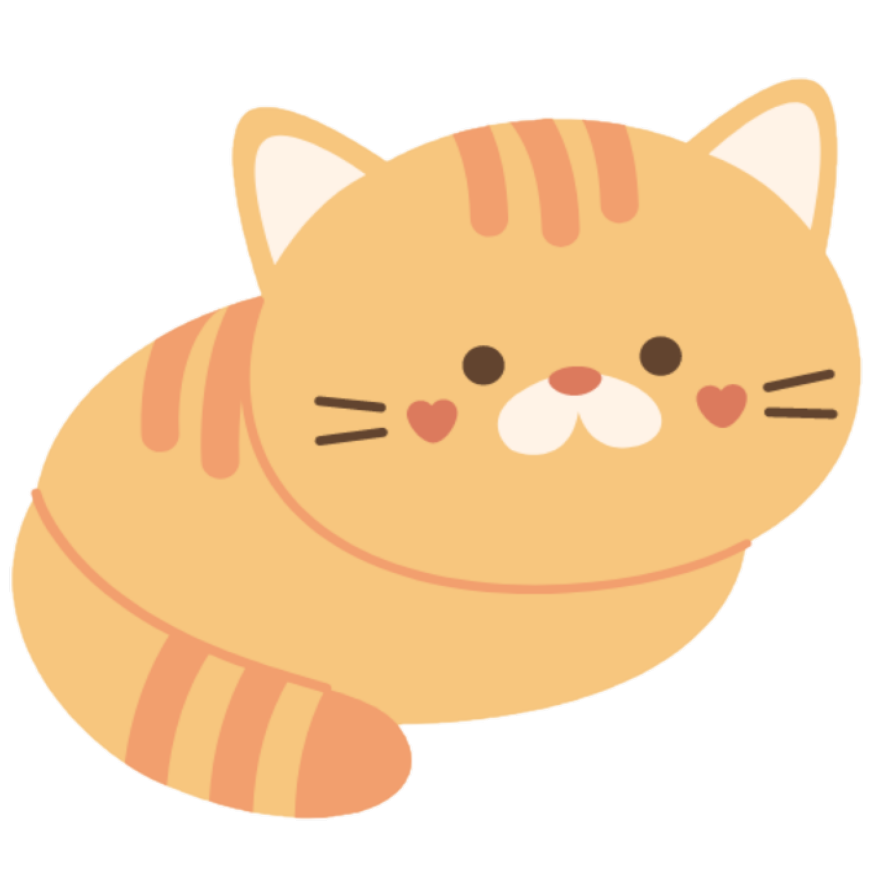
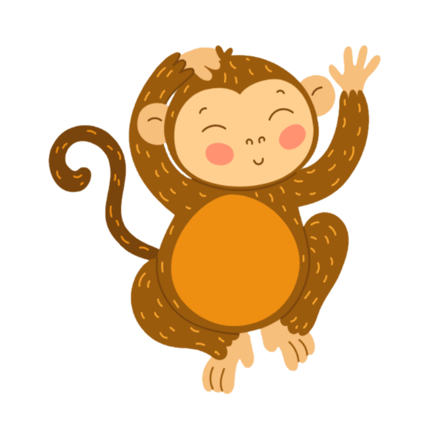

# Developing a Snake And Ladder Game 2 Players by MayMoeOo95

<br>
## Project Requirements
- Render a game in the browser.
- Include win/loss logic and render win/loss messages in HTML.
- Build with HTML, CSS & JavaScript in separate files.
- No remaining dead and/or commented out code.
- Have functions and variables that are named sensibly.
- Be coded in a consistent manner.
- Game is deployed online.
<br>
## Timeframe
1 week
<br>
## Technologies and Tools Used
- HTML
- CSS
- JavaScript
- GitHub
- Visual Studio
<br>
## Game Description
Snake And Ladder is a classic global board game that has been played since the 2nd century BC. 
[Game History](https://timesofindia.indiatimes.com/who-invented-the-board-game-snakes-and-ladders/articleshow/3585003.cms) 
This game was made using HTML, CSS and JavaScript as the 1st project for my journey at 
[Software Engineering Immersive Bootcamp](https://generalassemb.ly/education/software-engineering-immersive/singapore) at General Assembly .

I started my programming journey due to my curiosity about how things become. The curiosity that I often felt when I was young. Thus, I wanted to recreate this simple beloved game that is one of my favourite games played and it reminds me of my childhood.

<br>
## How to Play?
*At the start of the game all players start at tile number 1.
*Each player will take turns to roll the dice. Player 1 will start 1st.
*Player will move forward the number of spaces shown on the dice.
*If player lands at the bottom of a ladder, player can move up to the top of the ladder.
*If player lands on the head of a snake, player must slide down to the bottom of the snake.
*The first player to get to the space that says 'Home Tile 30' is the winner.
<br>

## Game Deployment

[Click to Play](https://maymoeoo95.github.io/2Players_Snake_N_Ladder/)
<br>

## Approach to Deployment

There will be 4 different screens in this game using different div.
|Screens Names        | Purpose                                                           |
|---------------------|-------------------------------------------------------------------|
|1. Welcome Screen    | To welcome players to the game.                                   |
|2. Rules Screen      | To inform players how to play the game.                           |
|3. Play Game Screen  | For players to play                                               |
|4. Reset Screen      | To display the the winner and return back to the Welcome Screen   |


* Show and Hide Screens - 
It is very messy to show all the above screens at once, hence we need to show whats needed and hide the remainding. DOM addEventListener and CSS display = "none" and display = "block" helps to achieve it. 

By default, only the Welcome Screen will be displayed. When player click on the  button, Rules Screen will be disaplyed and the remainding will be hidden. Using this approach, I was able to organize and show individual screens as needed.  

```
function rulesButton() {
  document.getElementById("rulesButton").addEventListener("click", function () {
    screens[0].style.display = "none";
    screens[1].style.display = "block";
    screens[2].style.display = "none";
    screens[3].style.display = "none";
  });
}
```

* Dice - 
When the player click roll the dice button, randon number from 1 to 6 will be generated then the dice.innerText will be displayed to inform player the number they have rolled. The combination of Math.random and Math.floor method was used to generate the dice number. 

```
function rollDice() {
  diceButton.addEventListener("click", function rollDice() {
    const dice = [, 1, 2, 3, 4, 5, 6];
    let randomIndex = Math.floor(Math.random() * 6 + 1);
    rolledDice.innerText = dice[randomIndex];
    enableMovePlayerBtn();
  });
  renderAll();
}
```

* The Move player button is disable by default and its enable enable only after the dicebutton button has been clicked. This enable the player to only move after they roll the dice at their turn.  

```
function enableMovePlayerBtn() {
  moveCharacters.removeAttribute("disabled");
  console.log("enable move buttons");
}
function disableMovePlayerBtn() {
  moveCharacters.disabled = true;
  console.log("disable move buttons");
}
```

* Moving the players move - using the show and hide methods mention above, the icons of both player will be turn on and off according to the new position of the player which is determined by current position plus dice number the player has rolled.
Before  
In HTML, class name of dontShow is tagged to each player icon in individual tiles. Example of tile number 30 is shown below. 
```
<div id="r0I5" class="tile">30 <br>
    
    
</div>
```
In CSS,
```
.dontShow{
   display:none;
}
```
In Javascript, using DOM manipulation, player icons of tile 2 to 30 can be manipulated to either show or hide.
```
function boardCharacters() {
  if (character === "C") {
    document.getElementById(`${character}${currC}`).classList.remove("dontShow"); 
    document.getElementById(`${character}${prevC}`).classList.add("dontShow");
  } else {
    document.getElementById(`${character}${currM}`).classList.remove("dontShow");
    document.getElementById(`${character}${prevM}`).classList.add("dontShow");
  }
}
```

* Bonus and obstacles -
Landing on a sanke will get the player back by a few tiles while landing on the ladder gives player advantage of few tiles. Example below show the code for ladder.  
Code before:-
```
function bonusLadders() {
  if (currC === 3) {
    currC = 11;
    alert("WOW Ladder! Cat moves to tile 11!");
    playerlandOnNewTileNumMsg();
  } else if (currC === 7) {
    currC = 19;
    alert("WOW Ladder! Cat moves to tile 19!");
    playerlandOnNewTileNumMsg();
  } else if (currC === 21) {
    currC = 28;
    alert("WOW Ladder! Cat moves to tile 28!");
    playerlandOnNewTileNumMsg();
  }
  if (currM === 3) {
    currM = 11;
    alert("WOW a Ladder! Monkey moves to tile 11!");
    playerlandOnNewTileNumMsg();
  } else if (currM === 7) {
    currM = 19;
    alert("WOW a Ladder! Monkey moves to tile 19!");
    playerlandOnNewTileNumMsg();
  } else if (currM === 21) {
    currM = 28;
    alert("WOW a Ladder! Monkey moves to tile 28!");
    playerlandOnNewTileNumMsg();
  }
}
```

Code after:-
```
function bonusLadders() {
  const ladderPositions = {
    3: 11,
    7: 19,
    21: 28,
  };
  const catLadderPosition = ladderPositions[currC];
  const monkeyLadderPosition = ladderPositions[currM];
  if (catLadderPosition) {
    currC = catLadderPosition;
    alert(`WOW Ladder! Cat moves to tile ${currC}!`);
    playerlandOnNewTileNumMsg();
  }
  if (monkeyLadderPosition) {
    currM = monkeyLadderPosition;
    alert(`WOW a Ladder! Monkey moves to tile ${currM}!`);
    playerlandOnNewTileNumMsg();
  }
}
```

*  
<br>

## Final OutLook of the Snake and Ladder 2 Player Game


<br>

## Learning Points
<br>

## Future Impovements

1. (Multipplayers) Able to host more than 2 players
- 3 players
- 4 players

2. Player Characters selection

3. Different levels
- lvl 2 (tile numbers increase to 50, with 2 more snakes and 1 ladder)
- lvl 3 (tile numbers increased to 100, wiht 2 more long snakes and 2 short ladders)
  <br>

## Summary

<br>
## References
[Game History](https://timesofindia.indiatimes.com/who-invented-the-board-game-snakes-and-ladders/articleshow/3585003.cms)
[How to disable and enable buttons](https://stackoverflow.com/questions/13831601/disabling-and-enabling-a-html-input-button)
<br>
## Game Asset Atrributions
The below assets in this game are not owned by me. All rights belong to their original owners and artists as shown in the links below:-

